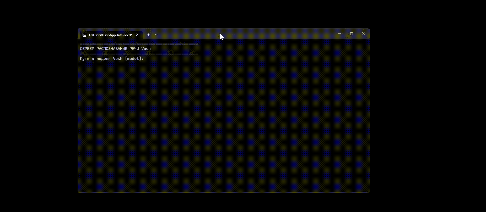

# MiSubtitles
**Дисклеймер **
> Я не разработчик Miside, все права на оригинальную игру принадлежат AiHasto. 

Экранные субтитры как в игре MiSide 
miside_letters.pyw - создать анимацию без голоса 

misubs_client.py - клиент для отображения субтитров, как в Miside 

misubs_server_vosk.py - сервер для распознавания речи на Vosk 

misubs_server_whisper.py - сервер для распознавания речи на OpenAi whisper 
 
ram_subs.py - другой клиент для отображения субтитров, вдохновлялся [этим](https://www.youtube.com/watch?v=H9qtQO5d8ko) 

